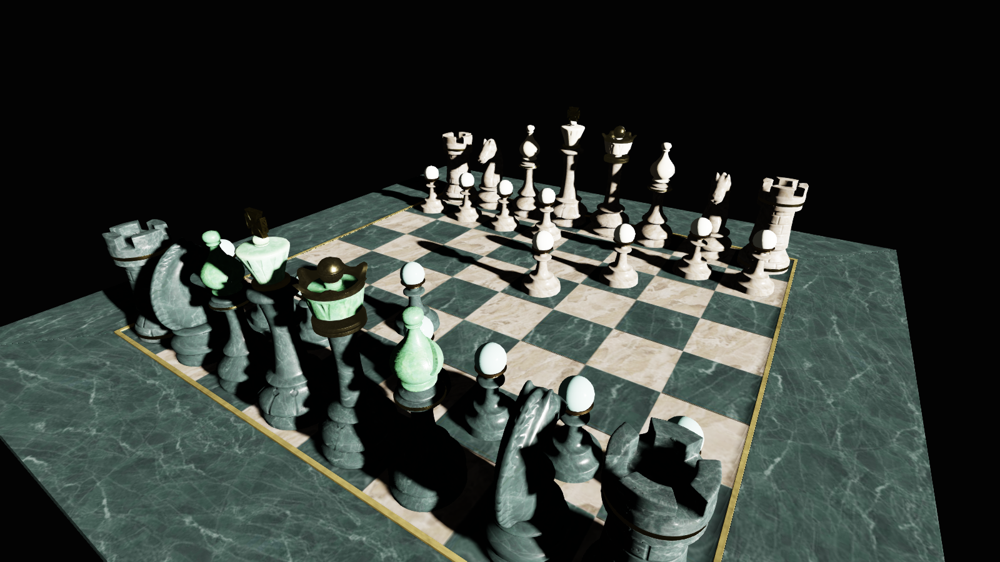
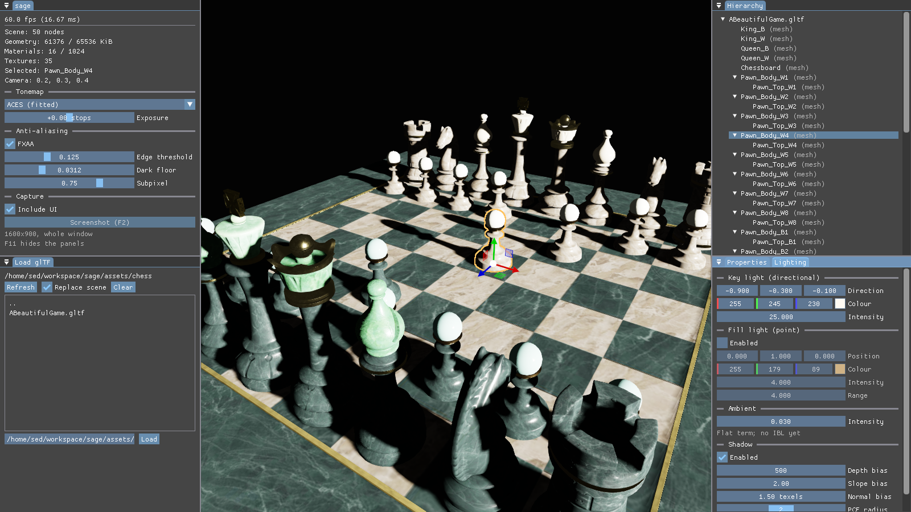
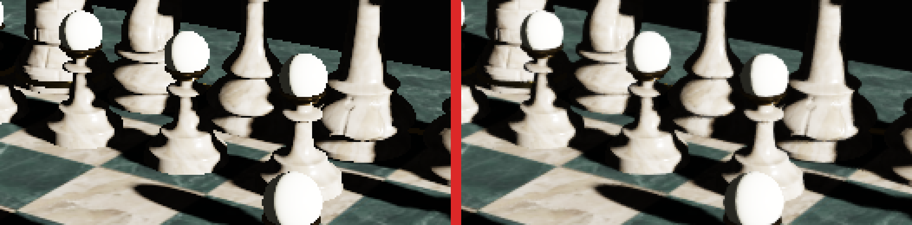
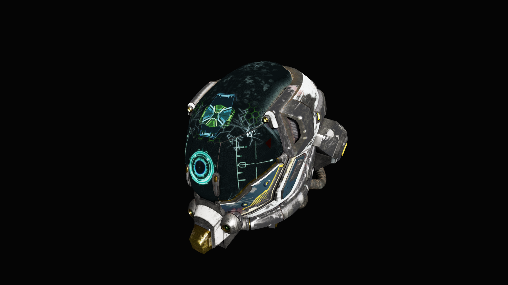

# sage

A standalone Vulkan 1.3 renderer and small scene editor, written from scratch to
work through modern GPU engineering: dynamic rendering with no `VkRenderPass`
anywhere, one bindless descriptor set, vertex data reached by buffer device
address, a physically based forward shading path, and an HDR pipeline ending in
a tonemap. Linux-only, C++20, Clang-first.



## Status

**v1.0.** Loads arbitrary glTF at runtime, shades it with a Cook-Torrance BRDF
under data-driven lights, casts shadows from a directional key light, resolves
through an HDR target and a selectable tonemap, anti-aliases, and writes the
result to a PNG. Objects can be picked in the viewport, outlined, and moved with
a gizmo.



### What it does

- **Device** — instance with validation, physical-device selection against an
  explicit required-feature set, graphics/present/transfer queues, VMA,
  swapchain, timeline-semaphore frame pacing.
- **Rendering** — dynamic rendering only, never a `VkRenderPass` or
  `VkFramebuffer`. Slang compiled to SPIR-V at build time; a pipeline cache
  persisted across runs.
- **Resources** — one bindless descriptor set (`UPDATE_AFTER_BIND`) holding
  storage buffers, the texture array, and each render target that a later pass
  reads back. Vertex data by device address, per-draw state in push constants.
- **Geometry** — one device-local suballocated vertex/index buffer fed by
  transfer-queue staging uploads with queue-family ownership transfer. glTF via
  fastgltf, into a mutable scene graph rather than a flattened list.
- **Materials** — base colour, normal, metallic-roughness and emissive maps
  decoded with stb, uploaded with layout transitions and a blit-generated mip
  chain. Material factors live in a device-local storage buffer, indexed per
  draw.
- **Shading** — Cook-Torrance GGX on the metallic-roughness workflow, with
  tangent-space normal mapping and emissive. Directional and point lights with
  windowed inverse-square falloff, read from a per-frame buffer.
- **Shadows** — a directional depth-only pass into a `D32_SFLOAT` map read
  through a comparison sampler, so every PCF tap is bilinear across four depth
  *tests* rather than four depths. The frustum is refitted each frame from live
  world transforms, so a shadow follows whatever the gizmo moves.
- **Presentation** — an `R16G16B16A16_SFLOAT` target so speculars above 1.0
  survive to be tonemapped rather than clamping at the attachment, a
  runtime-selectable curve (none / Reinhard / ACES) with exposure in stops, and
  FXAA.
- **Editor** — dockspace, scene hierarchy, properties, lighting and shadow
  controls; cursor picking by object-ID readback, subtree outlining from ID
  discontinuity, ImGuizmo for transforms, and screenshot-to-PNG.

### What it does not

No IBL — ambient is a single constant, so metals have nothing to reflect. No
global illumination, no ray tracing, no deferred path, no CUDA. Those are
recorded as deliberate scope decisions rather than omissions; see
[`CLAUDE.md`](CLAUDE.md) for the ladder and the standing prohibitions, and
[ADR 0024](docs/adr/0024-vulkan-only-cuda-cut.md) for why CUDA interop was
scoped, seriously considered, and cut.

### Anti-aliasing

FXAA rather than MSAA, and not only for cost: the scene pass writes an
`R32_UINT` object-ID attachment alongside colour, and resolving that is
meaningless — averaging two object IDs yields a third belonging to neither,
which would break picking and outlining together.



## Running

```bash
scripts/build.sh debug --run
```

That opens on an empty scene. Test models are fetched rather than committed:

```bash
python3 tools/fetch_assets.py
```

Then load one from the **Load glTF** panel, or name it on the command line:

```bash
./build/debug/src/app/sage assets/chess/ABeautifulGame.gltf
```

See [`assets/README.md`](assets/README.md) for what the models are and why they
are not in the repository.



The camera frames itself on whatever it loads. Controls follow Unreal's
viewport: **hold right mouse** to look, **WASD** to fly, **E**/**Q** for
up/down, **scroll** to change speed.

| | |
|---|---|
| **Left click** | select an object (the root of whatever was clicked) |
| **W** / **E** / **R** | move / rotate / scale gizmo |
| **F2** | screenshot to `screenshots/` |
| **F11** | hide the panels and give the render the whole window |

## Building

Requires Clang, GCC, Ninja, CMake ≥ 3.28,
[vcpkg](https://github.com/microsoft/vcpkg) (`VCPKG_ROOT` set in your
environment), and the [LunarG Vulkan SDK](https://vulkan.lunarg.com/).

The SDK must be on the environment before configuring — `find_package(Vulkan)`
resolves against `VULKAN_SDK`, and the validation layers are found through the
layer path the same script exports (see
[ADR 0004](docs/adr/0004-vulkan-toolchain-from-system-sdk.md)):

```bash
source ~/vulkansdk/<version>/setup-env.sh
```

Add that to your shell profile to avoid repeating it. Configure fails with an
explicit message if `VULKAN_SDK` is unset.

[ccache](https://ccache.dev/) is used automatically for every preset when it is
installed, and silently skipped when it is not — it is a speedup, not a
requirement.

Shaders are compiled by `slangc`, which local builds take from the Vulkan SDK.
CI installs a pinned [standalone Slang release](https://github.com/shader-slang/slang/releases)
instead, since the SDK is not packaged for apt and CI needs only the compiler.
Either is found via `PATH`.

```bash
cmake --preset debug && cmake --build --preset debug
ctest --test-dir build/debug --output-on-failure
./build/debug/src/app/sage
```

### Helper scripts

[`scripts/build.sh`](scripts/build.sh) wraps the above for any preset, and
sources the Vulkan SDK automatically if `VULKAN_SDK` is not already set:

```bash
scripts/build.sh                 # clang Debug
scripts/build.sh gcc-debug       # gcc Debug
scripts/build.sh asan --test     # sanitizers, then ctest
scripts/build.sh debug --run     # build, then launch the app
```

[`scripts/check.sh`](scripts/check.sh) runs everything CI enforces —
formatting plus both compilers built and tested — and is the thing to run
before committing:

```bash
scripts/check.sh                 # format check + clang + gcc
scripts/check.sh --fix           # reformat in place instead of failing
```

GCC is kept green as a second compiler:

```bash
cmake --preset gcc-debug && cmake --build --preset gcc-debug
```

Profile in `relwithdebinfo`, debug in `debug` — never benchmark a Debug build.
The `asan` preset adds AddressSanitizer and UndefinedBehaviorSanitizer.

## Design decisions

Non-obvious architectural calls are recorded as short ADRs in
[`docs/adr/`](docs/adr/) — what was decided, what it was decided against, and
what it cost. A few that carry the most of the design:

| | |
|---|---|
| [0011](docs/adr/0011-bump-suballocated-geometry-buffer.md) | one bump-allocated geometry buffer, and the rewind that additive loading needed |
| [0022](docs/adr/0022-lights-in-the-per-frame-buffer.md) | lights in the per-frame buffer rather than a storage buffer of their own |
| [0027](docs/adr/0027-object-id-selection-and-gizmos.md) | one `R32_UINT` attachment serving both picking and outlining |
| [0028](docs/adr/0028-hdr-target-tonemap-and-capture.md) | the HDR target, the tonemap, and capture |
| [0029](docs/adr/0029-shadow-mapping-and-fxaa.md) | shadow mapping, FXAA, and two bias defaults that were wrong in units |
